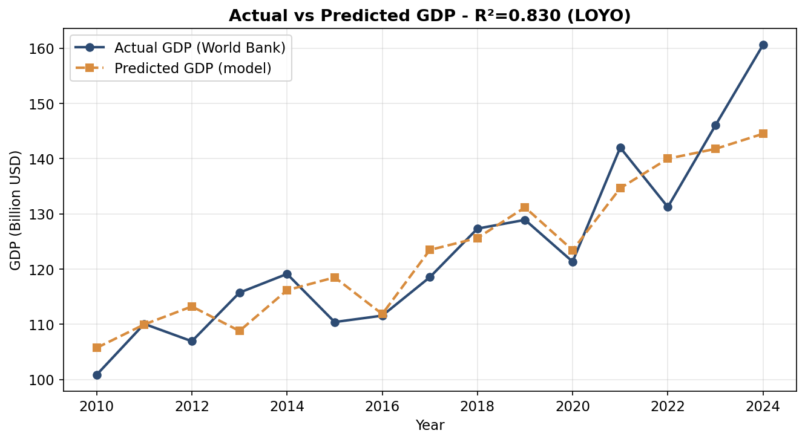
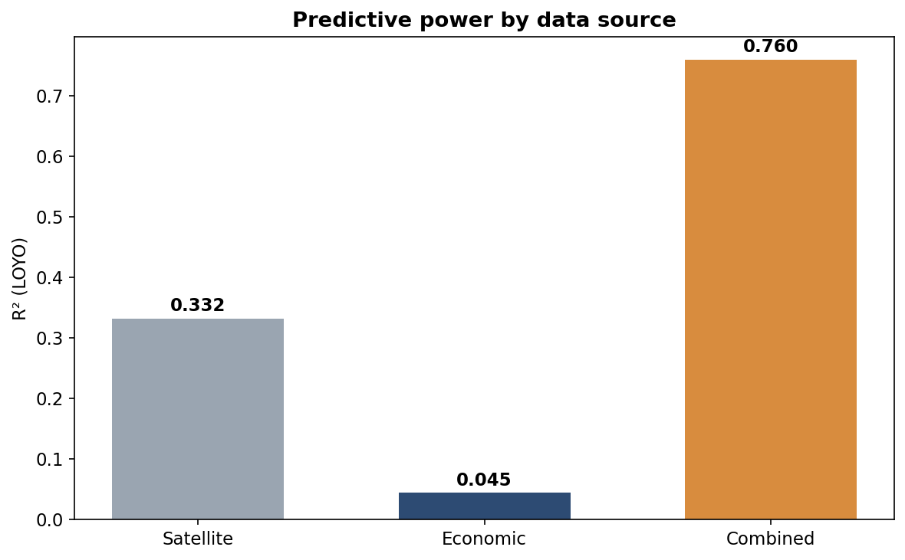

# Morocco GDP Nowcasting 🛰️

**Estimating Morocco's annual GDP in near real time from satellite imagery, search behaviour and economic indicators — months before the official figures are published.**

[](https://www.python.org/)
[](https://scikit-learn.org/)
[](https://streamlit.io/)
[](LICENSE)

> 📄 **Full thesis:** [`docs/thesis.pdf`](docs/) — Master's Final Year Project, Université Chouaib Doukkali (2026)
>
> ℹ️ The dashboard is not publicly hosted. It runs locally from the artefacts in this repository (see [Getting started](#getting-started)).

---

## The problem

Morocco's official GDP is published by the High Commission for Planning (HCP) **months after** the period it measures. That delay is a blind spot: when a shock hits — the 2020 pandemic, a drought year — decision-makers must react *before* any official measure of its magnitude exists.

Meanwhile, the economy emits signals that are available **immediately**: satellites measure vegetation and land surface temperature every month, search queries reflect household economic concerns in real time, and international institutions publish intermediate indicators well ahead of the national accounts.

**Research question:** *to what extent can Morocco's annual GDP be estimated in near real time, ahead of its official publication, by combining satellite, economic and behavioural data through machine learning?*

---

## Results at a glance

| Metric | Value |
|---|---|
| **R² (Leave-One-Year-Out, 30-seed average)** | **0.837 ± 0.008** |
| RMSE | $6.48 B |
| MAE | $5.13 B |
| MAPE | 4.04 % |
| Live nowcast (2024) | $159.97 B vs **$160.61 B official** → **0.4 % deviation** |



**Versus the baselines a decision-maker already has:**

| Predictor | R² | RMSE (B$) |
|---|---|---|
| Random walk (last year's GDP) | 0.553 | 10.08 |
| Linear trend | 0.735 | 8.10 |
| **Tuned Gradient Boosting** | **0.837 ± 0.008** | **6.48** |

> Moroccan GDP in current USD trends strongly upward, so a straight line already explains a lot. The model's genuine contribution is the **~0.10 of explained variance beyond the trend** — the part that captures drought years and the 2020 shock — plus a ~20 % RMSE reduction.

**The central finding — no single data family suffices:**

| Sources | R² |
|---|---|
| Satellite only | 0.33 |
| Economic only | 0.04 |
| **Combined** | **0.76** |

Fusion is what carries the performance. This replicates, for Morocco, the conclusion of Bolivar (2024) for Bolivia.



---

## Data

Annual dataset, **2010–2024 (15 observations)**, assembled from four families:

| Family | Source | Examples |
|---|---|---|
| 🛰️ Satellite | Google Earth Engine | NDVI, EVI (MODIS) · LST (MOD11A2) · CO, NO₂ (Sentinel-5P) · night lights (VIIRS) · precipitation (CHIRPS) |
| 📊 Economic | World Bank API, IMF DataMapper | GDP growth, FDI, capital formation, inflation, current account |
| 🌾 Agricultural | FAO (via World Bank) | Food production index, cereal yield |
| 🔍 Behavioural | Google Trends | Moroccan economic search terms (`salaire maroc`, …) |

**Target:** annual GDP in current USD (World Bank).

**Final feature set (7, selected from 40+ candidates):**
`salaire maroc` · `Food_production_index` · `LST_mean` · `FDI_percent_GDP` · `NDVI_mean` · `GDP_Growth_Rate` · `LST_max`

---

## Method — built for n = 15

Fifteen observations is an extreme small-sample regime. Standard practice breaks down, so the methodology is the core contribution:

**🔒 Leave-One-Year-Out (LOYO) validation.** Each year is held out in turn; a model is trained from scratch on the remaining fourteen. Every year is predicted exactly once by a model that has never seen it.

**🧬 Interpolation-based augmentation — training folds only.** Synthetic rows are convex combinations of two real training years, with a single α applied jointly to all features *and* the target (preserving correlation structure):

```
x_new = (1-α)·x_a + α·x_b        y_new = (1-α)·y_a + α·y_b
```

Critically, augmentation happens **inside each fold, after the test year is removed** — it is a training-time transformation, never a persisted dataset. Augmenting before splitting would let blended copies of a test year contaminate its own training set.

**📉 Augmentation size is not a performance lever.** A sweep (10 seeds per setting) shows saturation by N ≈ 1000–2000:

| N_aug | 50 | 250 | 1,000 | **2,000** | 5,000 | 10,000 |
|---|---|---|---|---|---|---|
| Mean R² | 0.751 | 0.804 | 0.832 | **0.836** | 0.838 | 0.837 |

`N_aug = 2000` is locked — on the plateau, low variance, ~6× faster than 10,000.

**🎲 Seed-stability analysis.** The full LOYO procedure is repeated over 30 random seeds → **0.837 ± 0.008**, 95 % range [0.823, 0.849]. A single score is never trusted on its own.

**⚖️ Six models compared under an identical protocol** — same folds, same augmentation, same metrics:

| Model | R² | RMSE (B$) |
|---|---|---|
| **Gradient Boosting** | **0.826** | 6.56 |
| Random Forest | 0.773 | 7.50 |
| SVR (RBF) | 0.675 | 8.97 |
| Ridge | 0.659 | 9.19 |
| ElasticNet | 0.410 | 12.10 |
| Lasso | −0.054 | 16.17 |

Tuned GBR: `n_estimators=300, learning_rate=0.05, max_depth=3`.

---

## Robustness — stress-testing the dominant variable

The `salaire maroc` search index carries 0.79 of the model's importance (SHAP: $10.9 B). A dependence that heavy has to be tested, not assumed away:

| Test | Result | Reading |
|---|---|---|
| **Ablation** — remove the variable | R² 0.831 → **0.463** | Heavy dependence, but the model retains real explanatory power from satellite + macro variables |
| **Detrending** — strip the linear time trend from both series | corr +0.92 → **+0.54** | If it were a pure trend proxy the correlation would collapse. It doesn't — over half survives, indicating genuine co-movement with economic activity |


---

## Honest limitations

Stated plainly, because they bound what the results mean:

1. **n = 15.** The methodological apparatus is designed to extract an honest estimate from this regime, not to escape it. Single-year confidence is modest.
2. **Concentration on one variable.** Documented and stress-tested, but a change in Google Trends' methodology or availability would directly affect the model.
3. **Search data properties.** Trends values are *relative* indices, subject to resampling variation and partly trend-driven. A frozen-snapshot policy neutralises reproducibility here; production would need drift monitoring.
4. **One target-derived feature.** `GDP_Growth_Rate` is published ahead of the definitive GDP level (so it's observable at nowcast time) but is derived from the target. Ablation reported: **without it, R² = 0.79** — the strictly leakage-free figure.

**Failure modes:** sharp rebound years are under-predicted (2021: −5.2 %; 2024: −10.0 %). In LOYO the model must estimate them without having seen a comparable acceleration, and interpolation cannot manufacture out-of-range examples. 2024 additionally suffers a boundary effect. The 2020 shock, by contrast, is captured well (+1.7 %).

---

## The platform

A **Streamlit** application that turns the model into a usable tool.

**Semi-live architecture:** a fully live pipeline (re-extracting satellite data through GEE per request) would be fragile in deployment. Instead — economic indicators are fetched **live** from the World Bank API (`Food_production_index`, `FDI_percent_GDP`, `GDP_Growth_Rate`); satellite and search variables use the **latest stored values**. The interface labels the provenance of every input, so users see exactly what the estimate rests on.

**Pages:** Home · Overview · Live Nowcast · Satellite Indicators · Model Results · Interpretability (SHAP) · Geographic View

---

## Repository structure

```
morocco-gdp-nowcast/
├── app.py                          # Streamlit application
├── requirements.txt
├── runtime.txt                     # python-3.11
├── models/
│   ├── gbr_model.pkl               # tuned Gradient Boosting (300 / 0.05 / 3)
│   ├── scaler_X.pkl, scaler_y.pkl  # fitted at export time
│   ├── feature_names.json          # locked feature order
│   └── model_metadata.json         # config + validated performance
├── data/
│   ├── Morocco_Annual_Clean.csv    # frozen annual dataset
│   ├── best_model_predictions.csv  # out-of-fold predictions
│   ├── model_results_tuned.csv     # six-model comparison
│   ├── residual_analysis.csv       # per-year errors
│   └── shap_interpretation.csv     # SHAP contributions
├── notebooks/
│   └── morocco_gdp_nowcasting_clean_FINAL.ipynb
├── figures/
│   ├── predicted_vs_actual.png
│   ├── three_source_comparison.png
│   ├── shap_importance_gbr.png
│   └── robustness_analysis.png
└── docs/
    └── thesis.pdf
```

---

## Getting started

```bash
git clone https://github.com/BOUAYADYassine110/morocco-gdp-nowcast.git
cd morocco-gdp-nowcast

python -m venv venv
source venv/bin/activate        # Windows: venv\Scripts\activate

pip install -r requirements.txt
streamlit run app.py
```

> ⚠️ **Version pinning matters.** The serialised model carries scikit-learn and NumPy internals; loading it under mismatched versions raises errors such as `ModuleNotFoundError: No module named '_loss'` or `MT19937 is not a known BitGenerator`. `requirements.txt` pins the exact versions the artefacts were saved with — install from it rather than upgrading ad hoc.

**Reproducing the model:** run `notebooks/morocco_gdp_nowcasting_clean_FINAL.ipynb` top to bottom from a fresh kernel. All random seeds are fixed and the pipeline reads exclusively from frozen CSV snapshots, so every number in the thesis reproduces exactly.

---

## Reproducibility policy

Several sources — Google Trends in particular — are **not deterministic**: refetching the same series later can return different values, silently changing downstream results. All datasets are therefore committed as **frozen CSV snapshots**, and the modelling pipeline never issues live queries. This was adopted after a real incident during the project and is treated as a methodological requirement, not a convenience.

---

## References

- Henderson, Storeygard & Weil (2012). *Measuring Economic Growth from Outer Space.* American Economic Review, 102(2).
- Choi & Varian (2012). *Predicting the Present with Google Trends.* Economic Record, 88(s1).
- Giannone, Reichlin & Small (2008). *Nowcasting: The real-time informational content of macroeconomic data.* Journal of Monetary Economics, 55(4).
- Yeh et al. (2020). *Using publicly available satellite imagery and deep learning to understand economic well-being in Africa.* Nature Communications, 11.
- Bolivar (2024). *GDP nowcasting: A machine learning and remote sensing data-based approach for Bolivia.* Latin American Journal of Central Banking, 5(3).
- Chawla et al. (2002). *SMOTE.* JAIR, 16. · Zhang et al. (2018). *mixup.* ICLR. · Friedman (2001). *Greedy Function Approximation.* Annals of Statistics, 29(5).

---

## Author

**Yassine Bouayad** — MSc Business Intelligence & Big Data Analytics, Université Chouaib Doukkali (Faculté des Sciences d'El Jadida)

Supervised by **Pr. Abdelmjid El Moutaouakil** · Defended July 2026

[GitHub](https://github.com/BOUAYADYassine110) · [LinkedIn](https://www.linkedin.com/in/) <!-- add your LinkedIn URL -->

---

## License

MIT — see [LICENSE](LICENSE).

*Data belongs to its respective providers (World Bank, FAO, IMF, NASA/USGS, ESA Copernicus, Google). The platform is a decision-support and research tool; it does not produce official statistics.*
